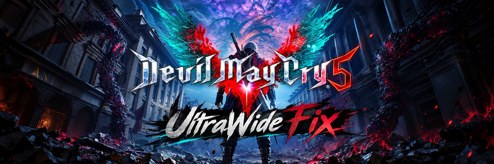
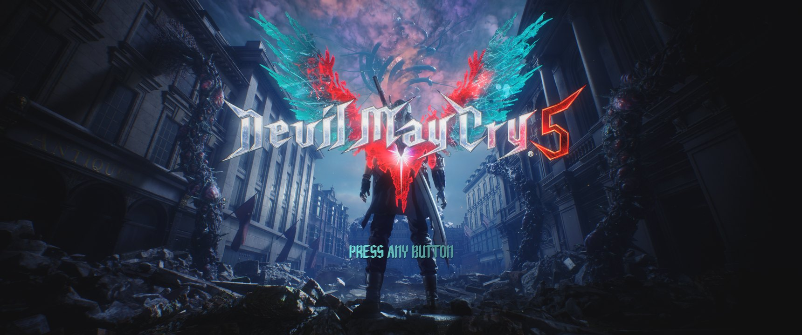
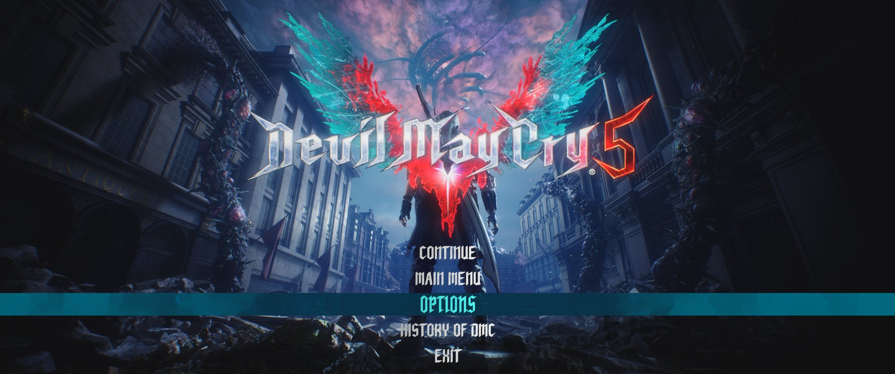
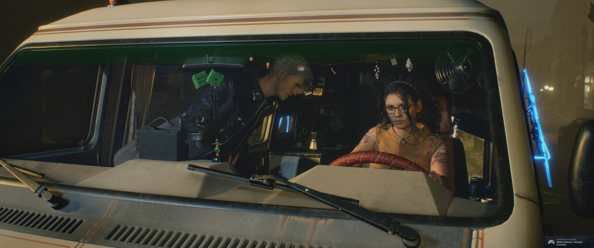
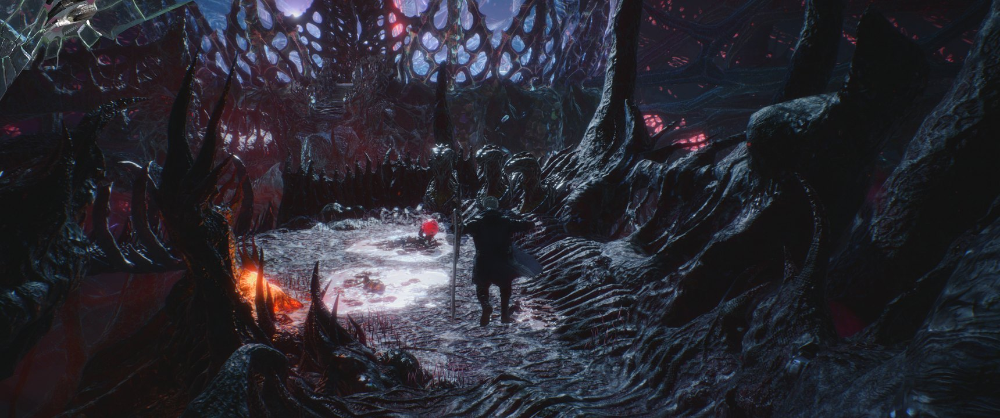

<p align="center">
  
</p>

<h1 align="center">Devil May Cry 5 UltraWide Fix</h1>

<p align="center">
  Removes the black bars on 21:9 and 32:9 monitors and keeps the HUD, menus and cutscene fades where they belong.<br>
  Works on the <strong>current Steam build</strong>, the one that killed the old hex-edit patchers.
</p>

<p align="center">
  <a href="LICENSE"></a>
  
  <a href="https://github.com/praydog/REFramework"></a>
  
  <a href="README.pt-BR.md"></a>
</p>

---

## Table of contents

- [TL;DR](#tldr)
- [Screenshots](#screenshots)
- [Why the old fixes stopped working](#why-the-old-fixes-stopped-working)
- [Install](#install)
  - [One-liner (Linux)](#one-liner-linux)
  - [Script options](#script-options)
  - [Manual install (Linux or Windows)](#manual-install-linux-or-windows)
  - [Steam launch options (Linux / Proton)](#steam-launch-options-linux--proton)
- [Verify it is working](#verify-it-is-working)
- [How it works](#how-it-works)
- [Tuning](#tuning)
- [Tested on](#tested-on)
- [FAQ and troubleshooting](#faq-and-troubleshooting)
- [Uninstall](#uninstall)
- [Report your results](#report-your-results)
- [Credits](#credits)
- [License](#license)

## TL;DR

```bash
curl -fsSL https://raw.githubusercontent.com/sidnei-almeida/dmc5-ultrawide-fix/main/install.sh | bash
```

Close Steam first so the script can also set the launch option for you. Then start the game.
No hex editing, no binary patching: the game executable is never touched.

## Screenshots

All captures are straight from the game at **3440x1440** on Linux (Steam, Proton GE).

| Title screen | Main menu |
|---|---|
|  |  |

| Real-time cutscene |
|---|
|  |

What REFramework's ultrawide fix looks like **without** the HUD script shipped here (the health bar frame is scaled by the width ratio and pushed off-screen, top-left corner):



## Why the old fixes stopped working

The classic "Vergil Ultrawide Fix" and the HxD recipes replaced one float in `DevilMayCry5.exe`
(`6E 40 00 00 80 41 C3 F5 38` → `... AC 41 ...` for 3440x1440). The Steam update of
**November 22, 2025** (build 24901913) changed the executable layout and that byte pattern no
longer exists, so those patchers have nothing to find:

```
$ grep -c "6E40000080 41C3F538" DevilMayCry5.exe   # (as bytes)
0
```

This package does the same job at runtime through [REFramework](https://github.com/praydog/REFramework),
which hooks the RE Engine itself and survives game updates.

## Install

### One-liner (Linux)

```bash
curl -fsSL https://raw.githubusercontent.com/sidnei-almeida/dmc5-ultrawide-fix/main/install.sh | bash
```

The script:

1. finds the game in every Steam library on the machine (plus Heroic, Lutris and Bottles prefixes);
2. copies `dinput8.dll` (REFramework), the ready-made `re2_fw_config.txt` and the Lua scripts into the game folder, backing up any `dinput8.dll` already there;
3. adds `WINEDLLOVERRIDES="dinput8=n,b"` to the game's launch options in your Steam profile, **if Steam is closed** (it prints the line to paste otherwise).

Or clone it and run `./install.sh`.

### Script options

```
./install.sh [--path <game dir>]... [--uninstall] [--dry-run] [--no-launch-options]

  --path DIR            Game folder containing DevilMayCry5.exe (repeatable).
  --uninstall           Remove the fix and restore a backed-up dinput8.dll.
  --dry-run             Show what would be done without changing anything.
  --no-launch-options   Leave Steam's launch options alone.
```

### Manual install (Linux or Windows)

Copy everything inside [`payload/`](payload) into the folder that contains `DevilMayCry5.exe`:

```
Devil May Cry 5/
├── DevilMayCry5.exe
├── dinput8.dll                      ← REFramework (nightly, universal build)
├── re2_fw_config.txt                ← ultrawide options already enabled
├── reframework_revision.txt
└── reframework/
    ├── autorun/
    │   ├── dmc5_uw_hud.lua          ← keeps HUD/menus inside the screen
    │   └── uiscale.lua              ← optional manual UI scaler (off by default)
    └── data/
        ├── dmc5_uw_hud.json
        └── uiscale.json
```

On Windows that is all. On Linux also set the launch option below.

### Steam launch options (Linux / Proton)

Wine ships its own `dinput8.dll`, so Proton must be told to prefer the one in the game folder:

```
WINEDLLOVERRIDES="dinput8=n,b" %command%
```

Steam → Devil May Cry 5 → Properties → Launch options. If you already use ReShade's `dxgi.dll`,
combine them: `WINEDLLOVERRIDES="dinput8,dxgi=n,b" %command%`.

## Verify it is working

- `re2_framework_log.txt` appears in the game folder on the first launch and contains `Game name: dmc5`.
- Press **Insert** in game: the REFramework menu opens. Under **Graphics → Ultrawide/FOV Options**,
  *Ultrawide/FOV/Aspect Ratio Fix* is ticked.
- The title screen fills the monitor: zero pure-black columns at the left and right edges.

## How it works

Three pieces, all applied at runtime, nothing written to the executable:

1. **REFramework's Ultrawide fix** (`Graphics_UltrawideFix=true`) sets the scene view's
   `DisplayType` to the monitor's real aspect (`Uniform21x9`, `Uniform32x9`, …) instead of the
   16:9 pillarbox, and with `UltrawideFixVerticalFOV_V2=true` it keeps the vertical FOV identical to
   16:9 and widens only the horizontal one, so nothing gets cropped.

2. **`dmc5_uw_hud.lua`** hooks `re.on_pre_gui_draw_element` and, for every `via.gui.View` that is
   not a full-screen overlay, forces `ResolutionAdjust = true`, `ResAdjustScale = FitSmallRatioAxis`
   and `ResAdjustAnchor = CenterCenter`. DMC5 draws its HUD and menus with **World**-type views that
   REFramework's own *Constrain UI* option deliberately skips (it only touches *Screen* views), which
   is why the stock option leaves the health bar off-screen.

3. **Fades and cutscene overlays are left untouched.** `Fade_InGame`, `Fade_Menu`, `Fade_Loading`,
   `ClipPlayGUI` and friends are 1920x1080 quads with `ResolutionAdjust = false` and `Stretch`
   scaling. Forcing a fit mode on them (what *Constrain UI* does) parks the quad over the top half of
   the screen, which shows up as a dark rectangle during every cutscene transition. The shipped
   config therefore keeps `Graphics_UltrawideConstrainUI=false` and the script skips those names.

Everything the script does was derived from logging each GUI element's original `ViewType`,
`ResolutionAdjust`, `ResAdjustScale` and `ResAdjustAnchor` on a fresh launch; turn on
*Log GUI elements* in the script's menu to see the same data in `re2_framework_log.txt`.

## Tuning

Press **Insert** in game.

- **Graphics → Ultrawide/FOV Options**: FOV multiplier, vertical-FOV mode, 16:10 letterbox mode.
- **DMC5 Ultrawide HUD**: toggle the HUD re-anchoring, enable element logging.
- **UI Scale**: [plneappl's UI Scaler](https://github.com/plneappl/dmc5_ui_scaler), shipped
  disabled. Untick *disable* if you prefer to place HUD elements by hand (x/y scale and offsets, with
  separate values for loading screens). Settings persist in `reframework/data/uiscale.json`.

## Tested on

| | |
|---|---|
| Resolution | 3440x1440 (21:9) |
| Game build | Steam 24901913, update of 2025-11-22 |
| OS | Arch Linux (Omarchy), Hyprland |
| Proton | GE-Proton 11-7 |
| REFramework | nightly `d1461375` (see `payload/reframework_revision.txt`) |
| Checked | title, main menu, pause/options, cutscenes, fades, mission gameplay |

32:9 and 3840x1600 are handled by the same code paths in REFramework (`Uniform32x9`,
`Uniform21x9`) but were not tested here. Please [report](#report-your-results).

## FAQ and troubleshooting

**No `re2_framework_log.txt` is created.** REFramework never loaded. On Linux the launch option is
missing or Steam was open when the installer ran; set it by hand. Also check that `dinput8.dll`
sits next to `DevilMayCry5.exe`, not in a subfolder.

**The REFramework menu does not open with Insert.** Some keyboards/layouts map it elsewhere; the key
can be changed in `re2_fw_config.txt` (`REFrameworkConfig_MenuKey_V2`).

**A dark rectangle covers the top half of the screen when a cutscene starts.** *Ultrawide: Constrain
UI to 16:9* got enabled (it is off in the shipped config). Untick it under Graphics → Ultrawide/FOV
Options and **restart the game**: resolution-adjust settings stick to the GUI objects until the
process exits, so a *Reset scripts* is not enough.

**I use ReShade / Fluffy Mod Manager.** ReShade's `dxgi.dll` coexists fine; add `dxgi` to the
override list as shown above. Fluffy's pak mods do not interact with this fix.

**Will a game update break it?** The nightly REFramework binary is universal and detects the game
at runtime. If a future update changes the type database it may need a newer nightly; drop the new
`dinput8.dll` from [REFramework-nightly releases](https://github.com/praydog/REFramework-nightly/releases)
over the old one, everything else stays.

**Does this work on Windows?** Yes: same files, no launch option needed. It was not tested here.

## Uninstall

```bash
./install.sh --uninstall
```

Removes the DLL, the config, the scripts and the launch option, and restores `dinput8.dll.bak` if one
was made. Manual: delete `dinput8.dll`, `re2_fw_config.txt`, `re2_framework_log.txt` and the
`reframework/` folder.

## Report your results

Open an issue with the [results template](.github/ISSUE_TEMPLATE/results.md): resolution, OS,
Proton version, what works and a screenshot of anything that does not.

## Credits

- [praydog/REFramework](https://github.com/praydog/REFramework) (MIT): the mod loader and the
  ultrawide/FOV implementation. `payload/dinput8.dll` is an unmodified nightly build.
- [plneappl/dmc5_ui_scaler](https://github.com/plneappl/dmc5_ui_scaler) (MIT): the optional UI
  Scaler script.
- The PCGamingWiki and WSGF communities for documenting the original hex-edit fix.

## License

The installer, the HUD script and the documentation are MIT, see [LICENSE](LICENSE). REFramework
and the UI Scaler keep their own MIT licenses (`payload/reframework/autorun/LICENSE-uiscale.txt`).
